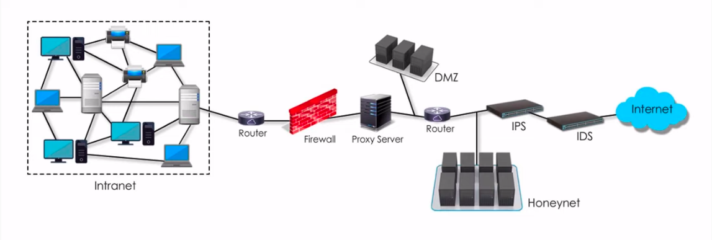

___
# Différence XSS ET CSRF

## Attaque XSS

Attaque utilisant une faille du site web, qui permet d'injecter du contenu dans une page (attaque front-end). 
En fait, lorsque le site a une faille xss, il suffit d'injecter du code dans la faille (champ, valeurs basées sur les headers...) qui pointe vers l'adresse IP souhaitée (notre machine pour un vol de cookie, une page frauduleuse pour du phishing). 
La redirection peut se faire avec une iframe, une image, un code javascript.
On envoie la requête malveillante à la victime dont le navigateur exécutera notre payload.

- Utilisé dans le phishing : redirection d'un utilisateur.
- Des vols de cookie. 
- Utilisation d'exploit contre le navigateur. 

### Stockée

Le payload est stocké par le serveur (bdd, fichiers) et exécuté chaque fois qu'un client se rendra sur la page comportant la faille.

### Non stockée

Le contenu est affiché à chaque fois que la victime clique sur le lien fauduleux.

### DOM 

Exécution de code directement dans le navigateur de la victime, à travers l'utilisation d'une des fonctionnalités du site qui possède une faille, comme un algorithme JavaScript.

______

## CSRF 

Attaque qui utilise une faille d'un site web afin de transmettre à un utilisateur authentifié une requête HTTP falsifiée qui pointe sur une action à un autre site, afin qu'il l'exécute sans en avoir conscience et **en utilisant ses propres droits**.
On utilise la vulnérabilité d'un site A pour que la victime effectue une action sur un site B.  
Pour se protéger de ce type d'attaque, le navigateur utilise l'instruction `Samesite` stockée dans le cookie de session. Une fois activé, le site web n'acceptera les reqûetes que si celle-ci viennent du même site.

____

## DIFFERENCES XSS CSRF

1. CSRF le site requière une session authentifiée, à contrario d'XSS.
2. XSS permet à un attaquant d'exécuter du code sur le navigateur de la victime. CSRF permet à un attaquant de faire effectuer une manipulation à une victime. 
3. XSS conséquences > CSRF conséquences

___

# Hash, chiffrage et sel

Un hash est une fonction unidirectionnel (A donne B, on ne peut pas retrouver A à partir de B). 

Le chiffrage est une fonction bi directionnelle.

Le salage est une méthode permettant de renforcer ces sécurités en y ajoutant une donnée aléatoire supplémentaire. Ceci permets d'empêcher que deux informations identiques, avec la même fonction de hashage, donnent le même résultats.

* *Exemple de chiffrage asymétrique :* RSA, ElGamal, courbes elliptiques
* *Exemple de chiffrage symétrique* :* DES, AES, Blowfish 

___

# HTTP 1.0/1.1

1.0 : sans état ie pour chaque paire requête/réponse, on doit ouvrir une connection.  
1.1 : avec état ie pour chaque paire, on peut garder la même connection http.

___

# Chiffrage asymétrique

Utilisation d'une paire de clé **unique** publique/privée.

Publique : clé pour chiffrer un message, peut être partagée. 
Privée   : clé pour déchiffrer le message de la clé publique, doit être conservée en sécurité.  
Seul la clé privée peut déchiffrer le message chiffré avec la clé publique.

TLS (v1.3, ajd): chiffrage asymétrique pour le handshake (algorithme lourd) puis symétrique une fois que les algorithmes de chiffrage symétrique ont été adoptés par le client et le serveur (algorithme léger).  

*Fonctionnement de TLS (par exemple HTTPS):*  
    
    1. Le navigateur du client envoie au serveur une demande de mise en place TLS.
    2. Le serveur envoie au client son certficat (clé publique, informations, signature)
    3. Le navigateur tente de vérifier la signature du serveur d'après une liste pré-intégrée à celui-ci.
    4. Si le certificat est vérifié, le client génére une clé symétrique (clé de session) qu'il chiffre avec la clé publique du serveur.
    5. Le serveur déchiffre la clé de session avec sa clé privé, la communication peut commencer.

___

# Identification, authentification, autorisation

* Identification : **je soumets mon identité au service en question.**
*=> Je suis l'utilisateur Kalimero*

* Authentification : **j'apporte la preuve de mon identité.**
L’authentification est un processus permettant au système de s’assurer de la légitimité de la demande d’accès faite par une entité afin d’autoriser l’accès de cette entité à des ressources du système. » Par exemple, en comparant le mot de passe saisi avec celui stocké dans la base de données.
*=> Mon mot de passe est xxxx.*

* Autorisation : **fonction spécifiant les droits d’accès vers les ressources.**

____

# Solutions utilisées par les entreprises afin de garantir leur cybersécurité.

## IDS (Intrusion-Detection System)

Mécanisme destiné à scanner un réseau ou un hôte afin de repérer des activités anormales ou suspectes.
Il en existe deux catégories :  

1. Détection par signature, appelés SIDS pour Signed-based IDS.
    L'IDS se repose sur des bibliothèques de description des attaques afin de reconnaître des malwares.
    Efficace seulement si la base de signatures est maintenue à jour régulièrement.
    Utilisation d'arbre de décision et de système de transition d'état.
     

2. Détection par anomalie, appelés AIDS pour Anomalie-based IDS.
    Le but est de détecter les écarts par rapport à un modèle défini. 2 phases : 
    * Phase d'apprentissage, au cours de laquelle l'IDS va étudier des comportements normaux de flux réseau.
    * Phase de détection, l'IDS analyse le trafic et cherche à identifier des événements anormaux.

    Utilisation de réseaux de neurones artificiels, modèle de Markov caché.

## IPS 

Logiciel et/ou matériel permettant de rejetter des paquets réseau en fonction d'un profil de sécurité si ces paquets représentent une menace connue (bruteforce, DoS, exploitation de vulnérabilité).

## Différence IDS, IPS, firewall

* Pare-feu analyse l'en-tête du paquet pour voir si la communication est légitime.
* IDS analyse le paquet entier à la recherche d'un événement connu. Lorsque c'est le cas, un log est généré.
* IDS analyse le paquet entier à la recherche d'un événement connu. Lorsque c'est le cas, la connexion est rejetée.

La différence entre IDS et IPS est subtile, et n'est souvent rien de plus qu'un chagement de configuration.

## Firewall

Logiciel et/ou matériel permettant de filtrer et contrôler les communications entrantes sur un réseau privé. Le filtrage se fait selon divers critères, tels que : 
* Origine et destination des paquets (IP, ports, interface réseau)
* Options contenues dans les données (fragmentation, validité)
* Donnée en elle-même (taille, correspondance à un motif)
* Utilisateurs

## Proxy

Un proxy est une machine ou un logiciel qui se situe entre deux hôtes. Il se situe à la couche 7 d'OSI.  
5 caractéristiques : 

1. Cache l'adresse IP de ses clients grâce à sa fonctionnalité NAT (sécurité).
2. Permet de stocker des informations/installations en cache (performance).
3. Contrôle le traffic (surveillance et sécurité).
 * Entrant : contrôle des sites visités par des employés d'une entreprise
 * Sortant : bloque le traffic malicieux.
4. Stocke les logs du traffic (analyse d'incident).
5. Permet de contourner certaines restriction aux yeux d'un parefeu, par exemple (détournement).

## VPN

## Honeynet

 

## DMZ 

## SIEM (Security Information and Event Management)

Système permettant de centraliser et d'analyser toutes les alertes et les logs de sécurité d'un SI. Les données sont issues des appareils utilisateurs, équipement réseau, firewall, anti-virus, serveurs. Les collecteurs ainsi installés font suivre les événements à une console d'administration centralisée qui procède à des inspections et signale des anomalies.

## EDR (Endpoint Detection and Response)

Outils intégré à un endpoint (serveur,pc) afin de surveiller et de collecter les données qui pourraient être des menaces, muni d'analyses automatisées basées sur des règles. 
*Liste non exhaustive d'EDR* : 

1. Pare-feu local
2. Anti virus
3. Anti malware 
4. Protection antispyware
5. Chiffrage complet du disque

___
# Network Address Translation (NAT)

Technlogie intégrée dans les routeurs pour faire correspondre son IP publique avec les IP privées de son LAN. Afin de lutter face à l'épuisement des adresses IPv4, cette fonction est très largement utilisée par les box internet ou les réseaux privés virtuels. Les IP privées, ni uniques ni routables, sont celles compris dans les range ci-dessous.

* 10.0.0.0 à 10.255.255.255
* 172.16.0.0 à 172.31.255.255
* 192.168.1.0 à 192.168.255.255

Il existe différents types de NAT : 

## **PAT (Port Adress Translation)**

Le plus connue et le plus utilisé.  
Avec la technologie PAT, une adresse ip publique peut être associée à des adresses ip privées grâce à une assignation de port différente pour chaques appareils du LAN.
 Le port source a une double utilité : il distingue à quelle appareil et à quelle application la donnée appartient.
  Lorsque `192.168.1.2:1234` effectue une requête au serveur web `55.66.77.88:80`, le routeur change l'ip source de la requête et la remplace par la sienne `11.22.33.44` pour transiter sur internet. Il associe ensuite `192.168.1.2:1234` à son adresse ip publique avec le port source `11.22.33.44:1234` dans une table (mapping).   
| INTERNE           | EXTERNE      |
| -----------------|:---------------
| 192.168.1.2:1234 | 11.22.33.44:1234 |

Lorsque la réponse du serveur arrive au niveau du routeur, tel que `55.66.77.88:80` à `11.22.33.44:1234`, celui-ci sait grâce au port de destination `1234` que la donnée est destinée à `192.168.1.2`. Il change alors l'adresse destination de la requête avec celle présente dans la table et achemine la donnée.

## **NAT statique**

Le NAT statique va lier une adresse IP internet à une adresse IP externe. La source `192.168.1.2` sera vue de l'extérieure comme `193.22.35.43` qui est une adresse IP routable sur internet. Le routeur s'occupe de l'association.

| INTERNE          | EXTERNE           |
| -----------------|:-------------------
| 192.168.1.1234   | 193.22.35.43      |

## **NAT dynamique**
___

___
# Linux : systemd - systemctl

`systemd` est un gestionnaire de système devenu la nouvelle norme pour Linux.
`systemctl` est l'outil de gestion 

# Ressources intéressantes

* Recensement des questions les plus posées en entretien : https://resources.infosecinstitute.com/topic/top-30-penetration-tester-pentester-interview-questions-and-answers-for-2019/

