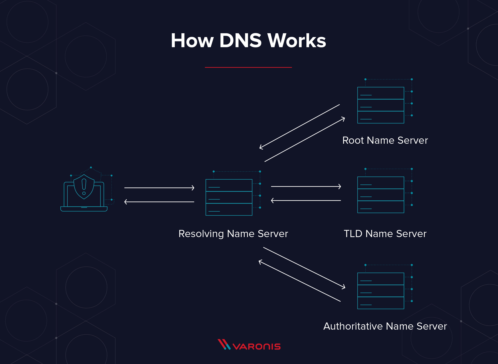

___
# Appellations

* A (hôte / victime) : 192.168.1.10
* B (passerelle)     : 192.168.1.1 
* H (hacker)         : 192.168.1.17

___
# Couche 2 - Liaison 

* Fonction : cette couche s'occupe de la livraison de **trames** entre appareils d'un même LAN. 
* Protocoles : Ethernet, ATM, PPP, STP

## Ethernet 

Protocole permettant de relier des noeuds (périphériques connectés entre eux) entre eux grâce à des câbles réseaux.  

## ATM

## Token ring

## SLIP

___
# Couche 3 - Réseau 

* Fonction : permet le routage, ie la détermination d'un chemin permettant de relier deux machines distantes. 
* Protocoles : ARP, BGP, ICMP, IPv4, IPv6

## ARP 

Objectif : associer une adresse MAC à une adresse IP. Dans un LAN, les appareils communiquent avec des MAC.

1. A : Broadcast : who has 192.168.1.1 ? 
2. B : Répond avec adresse mac, et met à jour son ARP cache avec les informations de A (ip - mac).
3. A : Met à jour son arp cache et peut désormais communiquer avec B.

## IP

Objectif : 

## ICMP

Objectif : 

## BGP

Objectif : protocole de routage (comme RIP, IGRP, OSPF)

___
# Couche 4 (Transport)

* Fonction : gère la communication de bout en bout des processus et corrige les erreurs.
  Cette couche utilise des sockets (ip + port) afin de faire communiquer 2 processus distants. Les deux processus sur les deux machines distinctes utilisents 2 ports différents. 
* Protocoles : TCP, UDP, RTP

## TCP (Transmission Control Protocole) 

* Protocole de transport fiable, en mode connecté.
* Les applications transmettent des flux de données sur une connexion réseau : TCP découple les flux d'octets en **segments**.
* Les données arrivent dans le bon ordre grâce aux numéros de séquences et d'acquittement.

Une session TCP se déroule en 3 étapes : 
A est le client, B le serveur.

1. Connexion (3-way handshake) : 
    * A : syn (seq = x)
    * B : syn/ack (seq = y, ack = x+1) 
    * A : ack (seq = x+1, ack = y+1)
2. Transfert des données avec contrôle de sequencing : 
    * A : seq = 43, ack = 79, data_length = 10
    * B : seq = 79, ack = seq + data_length = 43 + 10 = 53  
    => Côté serveur, le seq est le ack du client et le ack et le seq + data_length
3. Terminaison (4-way handshake) indépendante : 
    * A : fin (seq = x)
    * B : ack (ack = x+1)
    * B : fin (seq = y)
    * A : ack (ack = y+1)

*Liste non exhaustive de protocoles fonctionnant sur TCP :  FTP (21), SSH (22), Telnet (23), SMTP (25), HTTP (80), POP3 (110).* 

    

## UDP (User Datagram Protocol)

* Protocole de transport simple, non fiable et sans connexion.
* Le PDU associé à UDP est le **datagramme**.
* Adapté à un usage pour lequel : 
    1. La détection et la correction d'erreurs ne sont pas nécessaires
    2. Transmettre rapidement de petites quantités de données

*Liste non exhaustive de protocoles/process fonctionnant sur UDP : DHCP, DNS, jeux en lignes, streaming, visioconférence.* 

___
# Couche 5 (Session)

* Fonction : 
* Protocoles : TLS, SOCKS

___
# Couche 6 (Présentation)

* Fonction : 
* Protocoles : ASCII, MIME, AFP
___
# Couche 7 (Application)

## DHCP - client port 67, serveur port 68

* Objectif : permet à un hôte arrivant dans un réseau de demander une IP. Il

**DORA :** 

* A : Discover (broadcast) 
* B : Offer 
* A : Request
* B : Ack
___

## DNS (Domain Name System) - port 53

* Objectif : traduire un nom de domaine en adresse IP. 
   L'exemple qui sera pris sera : `fr.monsite.org`

* Pré-requis + glossaire :  
    1. La hiérarchie du DNS est représentée par un arbre. 
    2. **Domaine** : ensemble d'ordinateurs se situant au même niveau dans l'arbre.   
    *Exemple : org est le 1er niveau, monsite le 2nd, fr le 3ème et www le 4ème*
    3. **TLD (Top Level Domain)** : domaine de 1er niveau.  
    *Exemple : `org, fr, com, eu`*
    4. **SLD (Second Level Domain)** : domaine de 2nd niveau. Il s'agit de la partie gauche du nom de domaine 
    *Exemple : `monsite`*  
    A noter qu'il existe aussi des domaines de troisièmes niveau, comme `fr, www, m ou mail`. www est utilisé pour les services web et m pour les mobiles.
    5. **Nom de domaine** (DN): adresse d'un site internet.  
    *Exemple : `monsite.org`*
    6. **Sous-domaine** : domaine installé en dessous d'un autre domaine dans la hiérarchie du DNS. Pour cette raison chaque domaine (hors TLD) est un sous-domaine d'un autre domaine.
    7. **Zone** : partie distincte et contiguë de la hiérarchie DNS au sein de laquelle la responsabilité administrative a été déléguée à un seul gestionnaire, appelé **serveur autoritaire**. En général, on a 2 serveurs autoritaires pour une zone, par soucis de résilience. On distingue le **serveur autoritaire primaire** et **secondaire**.
      Une zone démarre à un domaine et s'étend vers le bas jusqu'à une feuille ou jusqu'au gestionnaire d'une nouvelle zone. Ainsi tous les sous domaine de cette zone ne sont gérées que par une seule entité, situé au top de la zone. 
    8. **Serveur DNS autoritaire** : serveur DNS qui sauvegarde des informations qui concernent une zone particulière de l'espace de noms de domaine dans sa base de données DNS. C'est le "responsable" de la zone.
 
* Fonctionnement (résolution de nom) : lorsque le nom de domaine est inconnu du cache du navigateur client et de celui du FAI (de base notre serveur DNS est celui fourni par notre FAI), le client lance une requête DNS au serveur de résolution de nom pour accéder à l'adresse IP.  
Plusieurs requêtes à différents serveurs seront envoyées :
    1. Au serveur root, pour savoir quel serveur est responsable du TLD `org`.
    2. Au serveur responsable du domaine `org`, pour savoir quel serveur est responsable du SLD `monsite`.
    3. Au serveur responsable du domaine `monsite`, pour savoir quel serveur est responsable du domaine `fr`. Celui ci détient l'adresse IP du DN `fr.monsite.org`, et l'envoie au client !

    Explication en image : 
    

    
      Le resolving name server est aussi appelé serveur DNS récursif. Si l'ip de l'application web est connue en cache, il n'interroge pas les autres serveurs.
    

 

* Avantages du DNS : 
    1. Ne pas à avoir à retenir une adresse IP (confort).
    2. L'adresse IP d'un serveur n'est pas forcément tout le temps la même : si le serveur hébergeant notre site web n'est plus accessible, il suffit que notre hébergeur fasse pointer notre DN vers le serveur de sauvegarde. Notre DN ne pointe alors pas un serveur mais un site web (résilience). 
    3. Un serveur peut héberger plusieurs sites (flexibilité)

* Lexique serveur DNS :  
Un serveur DNS est en réalité seulement un ensemble de clé/valeur. Voici différent type d'enregistrement.
    * A    : associe un DN à une adresse IPv4.
    * AAAA : associe un DN à une adresse IPv6.
    * PTR  : associe une IP à un DN. Permet de faire du reverse DNS, si on cherche à quel DN répond une IP.
    * CNAME : associe un alias au DN.
    * NS : indique quel serveur de nom a autorité pour le domaine.
    * MX : associe le nom de domaine à un serveur mail.

* Outils sous linux : 
    * `host [DN]` ou `nslookup [DN]` : trouver l'adresse IP pointée par le DN.
    * `dig [DN]` : outil pour interroger des serveurs DNS (outil le plus utilisé)

* Faiblesses et vulnérabilités du DNS :

    1. Les serveurs DNS internes contiennent tous les noms et les IP des serveurs de leurs domaines et les partagent avec n'importe quel utilisateur qui en fait la demande : le DNS est une précieuse mine d'informations pour les pirates qui cherchent à faire de la reconnaissance.
    2. Les caches DNS peuvent être empoisonnés par de mauvais enregistrements, et donc rediriger vers une mauvaise direction.
    3. Le DNS relaie les informations de requêtes des stations de travails internes vers des serveurs externes. 

* Attaques basées sur DNS : 
    1. Transfert de zone : procédure qui permet à deux serveurs DNS d'échanger leurs zones. Nécessaire pour la redondance. La méthode la plus connue utilise le protocole AXFR (client-serveur sur TCP). L'utilisation de cette procédure peut être détournée car elle ne requiert pas d'authentification. N'importe qui peut se procurer les informations d'une zone entière en utilisant AXFR. Ainsi, des attaquants peuvent utiliser ces informations pour conduire leurs attaques. Pour s'y protéger, il faut restreindre l'AXFR qu'à des IP de confiance.

* Sources : https://www.acunetix.com/blog/articles/dns-zone-transfers-axfr/

# Attaques réseaux

## ARP poisoning (3)

* Objectif       : Détourner les flux de communications entre une machine cible et une passerelle (routeur, box). L'attaquant peut ainsi écouter, modifier et bloquer les paquets réseaux. Attaque MITM.
* Outils         : Scapy (forger des paquets ARP) - Ettercap
* Fonctionnement : L'attaquant envoie en broadcast une requête ARP assimilant son adresse MAC avec l'adresse IP de la victime. 
* Contre-mesure  : Utiliser une table ARP statique, logiciel comme ARPwatch.

## DHCP Spoofing (2)

Attaque MITM. Sous kali linux, Ettercap. Inefficace si trafic chiffré.
Efficace si H répond avant B

1. A : Broadcast : who has 192.168.1.254 ? 
2. H : C'est moi, voici ma MAC.
3. A : Met à jour son arp cache. H est désormais espion.

